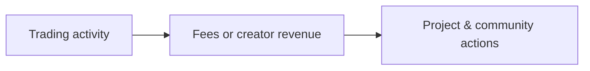
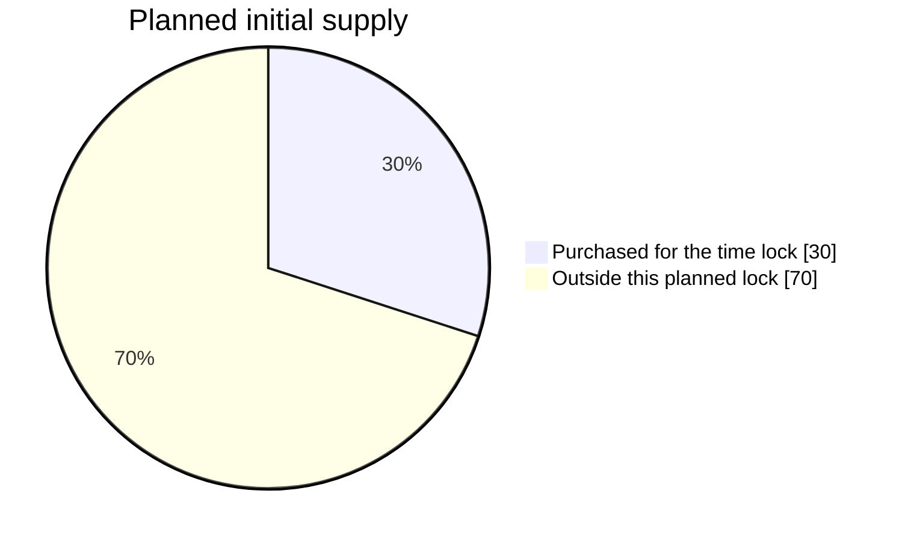
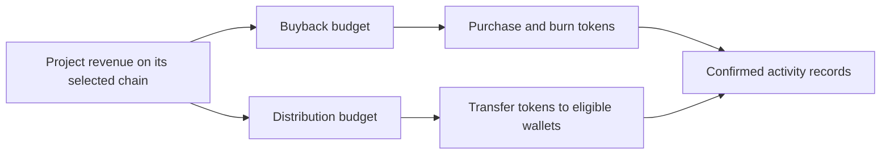

# SingleSpark Doc

From the first spark to a community. Understand what SingleSpark stands for, how the platform token is designed, and how plugins put trading activity to work.

## Contents

- [Platform philosophy](#platform-philosophy)
- [Platform token economics](#platform-token-economics)
- [Plugin playbook](#plugin-playbook)
- [Multi-chain plugin model](#multi-chain-plugin-model)
- [Transparency & participation](#transparency--participation)

## Platform philosophy

A meme starts with an idea. SingleSpark brings discovery, native token launches and revenue-powered plugins together so a community can follow what happens after launch.

### Start on familiar platforms

Launch through a supported platform with its native liquidity and trading rules. Choose the network and available tools that fit your project.

### Let activity support the community

Configured fees or creator revenue can fund buybacks, burns and token distributions. Each project follows its own selected rules.

### Make progress visible

Follow confirmed trades, plugin activity and transaction records. An enabled feature is a rule to execute, not evidence that it has executed.

This is the intended cycle. Market cap, user growth and individual project benefits depend on real demand.

## Platform token economics

**Planned · not live**

The planned Solana platform token launches on Pump.fun. Its governance model connects team token releases to a community satisfaction vote.

### Planned initial time lock

| Supply share | Purpose |
| --- | --- |
| 30% | Purchased for the time lock |
| 70% | Outside this planned lock |

The 30% is acquired by purchase, not a reserved mint allocation. The remaining 70% only describes supply outside this lock; it is not a separate team or community allocation.

### The community decides each release

Each planned vote lasts 24 hours. The winning side shares 10% of the daily token release, weighted by staking time. Its vote decides where the other 90% goes.

| Vote outcome | 90% of the daily release | 10% of the daily release |
| --- | --- | --- |
| If Satisfied wins | Released to the team | Winning voters |
| If Not satisfied wins | Permanently burned | Winning voters |

Governance is not live. The proposed daily release rate is 0.1%; its calculation basis, tie and no-vote rules, and final staking-time formula must be published before voting opens.

[Explore the DAO model](https://singlespark.fun/dao)

## Plugin playbook

Plugins connect a project’s trading revenue to repeatable actions. Choose the available plugins at launch, then follow their budgets and confirmed results on the token page.

### Buyback & burn

Turn trading revenue into buybacks that permanently remove tokens from circulation.

1. A configured share of trading fees or creator revenue accumulates in the buyback budget.
2. When the deployment’s budget, price and execution conditions are met, that budget buys tokens.
3. Purchased tokens are burned. Confirmed amounts and transactions appear on the meme’s page.

### Token distribution

Share a portion of trading revenue with eligible wallets through token distributions.

1. A configured share of trading fees or creator revenue funds the token distribution budget.
2. The deployment selects eligible wallets and waits for enough tokens and gas to execute.
3. Tokens are sent to eligible wallets. Eligibility, payout amounts and timing follow the launch’s rules.

### Choose your project’s combination

Buyback & burn focuses on removing tokens from supply. Distribution sends project tokens to eligible wallets. Where supported, both can run together with separate budgets. Review the available combination and whether choices are fixed before launching.

Plugin availability is shown for each chain and launch platform. A listed platform may still be a preview; enabling a plugin does not mean a buyback or distribution has already executed.

[Browse plugins & supported platforms](https://singlespark.fun/plugins)

## Multi-chain plugin model

SingleSpark uses one plugin workflow across supported chains and launch platforms: choose the project, enable available plugins, fund their budgets and verify each completed action.

The selected launch platform sets its native launch and trading fees. Review those fees, the project’s plugin settings and current availability before confirming.

### Revenue & plugin budgets

Trading fees or creator revenue fund the project’s configured plugin budgets. Allocations apply to revenue actually received after the launch platform’s own charges, not to the full trade amount.

The token page shows the project’s allocation, available balances and execution records. No collected revenue means no new plugin funding.

### 1. Fund separate budgets

Revenue is recorded for the project on its selected chain. Buyback and distribution budgets stay separate and follow the project’s configured allocation.

### 2. Execute when ready

Each plugin checks its funding, market conditions and network costs before acting. Distribution also needs eligible recipients and enough tokens. A budget or countdown is not a guarantee of execution.

### 3. Verify the result

Buybacks purchase tokens for burning; distributions transfer tokens to eligible wallets. Follow confirmed amounts, recipients and transaction links on the token page.

The plugin model is shared across chains; balances, budgets and transactions stay on their project’s chain. Funds are not automatically pooled or bridged between networks. Allocation percentages, eligibility and execution limits follow the selected project’s rules.

## Transparency & participation

Use the token page and public activity records to check what a project has actually done. Keep the following distinctions in mind when exploring the platform.

- Check the chain, launch platform, token address and enabled plugins. Existing deployments retain their configured rules.
- A budget or countdown is not a completed transaction. Burns and distributions appear as confirmed activity only after execution; open the transaction to verify it.
- DAO participation will open when its Solana governance is available. Until then, the displayed model describes the plan, with no live staking or voting.

[Explore tokens](https://singlespark.fun/tokens) · [View confirmed burns](https://singlespark.fun/burn)
